# **GPT-2 from Scratch (Small → XL)**
This repository demonstrates a from-scratch PyTorch implementation of GPT-2, supporting multiple scales: Small (124M), Medium (355M), Large (774M), and XL (1.5B). The project is designed to provide deep, hands-on understanding of transformer-based LLMs while remaining practical for real-world AI applications.

This repository implements all GPT-2 components from scratch input & positional embeddings, multi-head self-attention, causal masking, feedforward networks, GELU, LayerNorm, residual connections, transformer blocks, and the training loop with autoregressive generation, evaluation, and visualization; tokenization uses standard BPE with special tokens.

**Why it matters?**

* **Deep LLM mastery:** It helps to learn how embeddings, attention, and residuals interact to generate coherent text.
* **Scalable & practical:** This implementation supports multiple GPT-2 sizes and downstream tasks.
* **Production-ready pipelines:** Fine-tune for **classification** (spam, sentiment, grievances) or **instruction-following** assistants.

This project is a **hands-on bridge from foundational LLM engineering to real-world AI applications**.

---
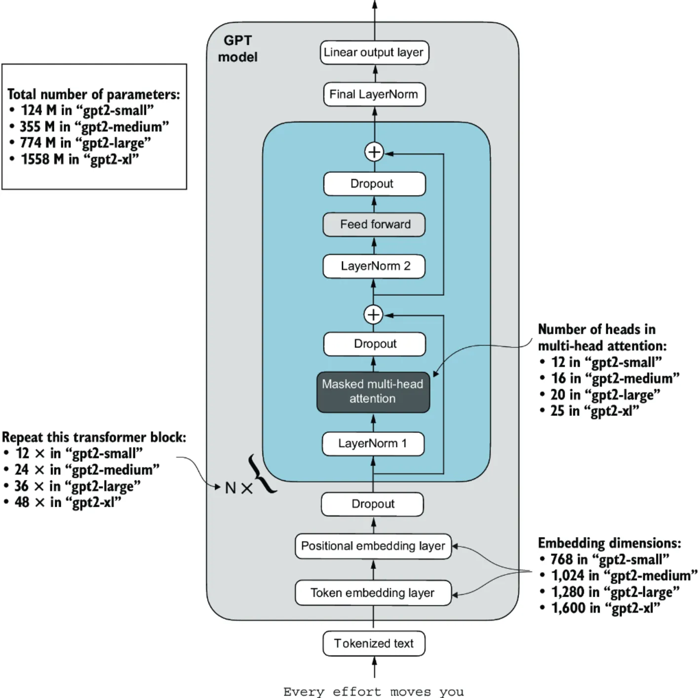
---


## **Table of Contents**

* [Part 1: GPT-2 From Scratch on Raw Text](#part-1-gpt-2-from-scratch-on-raw-text)

  * [Tokenization & Embeddings](#1-tokenization--embeddings)
  * [Transformer Block Implementation](#2-transformer-block-implementation)
  * [Attention Mechanisms](#3-attention-mechanisms)
  * [Autoregressive Text Generation and Decoding Strategies](#4-autoregressive-text-generation-and-decoding-strategies)
  * [Training Loop & Metrics](#5-training-loop--metrics)
  * [Results & Insights](#results--insights)
  * [Key Takeaways](#key-takeaways)
    
* [Part 2: Fine-Tuning GPT-2 for Text Classification](#part-2-fine-tuning-gpt-2-for-text-classification)

  * [Dataset Preparation](#1-dataset-preparation)
  * [Tokenization & DataLoader Engineering](#2-tokenization--dataloader-engineering)
  * [Model Architecture](#3-model-architecture)
  * [Training Configuration](#4-training-configuration)
  * [Evaluation & Performance](#5-evaluation--performance)
  * [Results & Insights](#results--insights-1)
  * [Key Takeaways](#key-takeaways-1)
    
* [Part 3: Instruction Fine-Tuning GPT-2 (355M)](#part-3-instruction-fine-tuning-gpt-2-355m)
  * [Dataset & Format](#1-dataset--format)
  * [Model & Training](#2-model--training)
  * [Evaluation Strategy](#3-evaluation-strategy)
  * [Practical Considerations](#4-practical-considerations)
  * [Results & Insights](#5-results--insights)
  * [Key Takeaways](#6-key-takeaways)
    
* [Installation](#installation)
* [Usage](#usage)
    
* [Contributing](#contributing)
* [Repository Structure](#repository-structure)
* [Getting Started](#getting-started)
* [License](#license)


---

## **Part 1: GPT-2 From Scratch on Raw Text**

**Objective:**
The objective was to recreate GPT-2 from the ground up and train it on `the-verdict.txt` to build a functional autoregressive language model.

> **Implementation Highlights:**

### 1. Tokenization & Embeddings

* Built a **custom tokenizer** with special tokens.
* Implemented **Byte Pair Encoding (BPE)** to handle out-of-vocabulary words.
* Converted raw text into **input-target pairs** using PyTorch `Dataset` and `DataLoader`.
* Combined **token embeddings** with **absolute positional embeddings** for structured input representation.

### 2. Transformer Block Implementation

* Implemented **LayerNorm**, **GELU activation**, **FeedForward networks**, and **residual connections** from scratch.
* Stacked **12 transformer blocks** to replicate GPT-2 (124M) architecture.
* Applied **weight tying** between input embeddings and output layer to reduce parameters.

### 3. Attention Mechanisms

* Implemented **self-attention**, **causal (masked) attention**, and **multi-head attention** in PyTorch.
* Verified **tensor dimensions** (B, S, d_model, d_k, d_v) and scaling by √d_k for gradient stability.
* Generated **context vectors** as dynamic, query-conditioned weighted sums of value vectors.

### 4. Autoregressive Text Generation and Decoding Strategies

* **Token-by-token generation** using advanced decoding strategies:

  * **Top-k sampling:** selects from the k most probable tokens, adding controlled randomness.
  * **Temperature scaling:** adjusts probability distribution smoothness; higher temperatures → more randomness, lower → deterministic outputs.
  * **Combined top-k + temperature:** balances creativity and coherence, improving text diversity while avoiding nonsensical outputs.
* Iteratively generated sequences to target length with coherent outputs, verifying qualitative text quality.

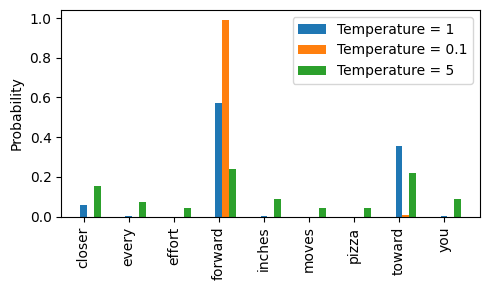


> **FIG: Temperature Scale Value Effect on Randomens of Text Generation** 

### 5. Training Loop & Metrics

* Optimizer: **AdamW** with learning rate scheduling and gradient clipping.
* Loss: **Cross-Entropy**, tracked for both training and validation.
* Perplexity analysis: e.g., `loss = 8.49 → perplexity ≈ 4875`.
* Observed overfitting on limited data; applied decoding strategies to improve generalization.

### **Results & Insights**

* Fully functional GPT-2 capable of generating coherent text sequences.
* Attention mechanisms, transformer internals, and decoding strategies validated end-to-end.
* Developed strong mastery of embeddings, attention, residuals, stacked architectures, and text sampling techniques.


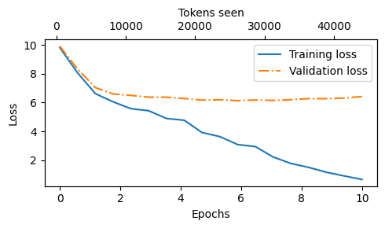
> Fig: Train and Validation loss vs epoch vs token_seen

### **Key Takeaways**

* Built complete GPT-2 pipeline: raw text → tokenization → embeddings → transformer blocks → autoregressive generation with controlled decoding.
* Hands-on implementation reinforces theoretical concepts and prepares model for downstream tasks.
* Demonstrates **top-tier skills in PyTorch, transformer internals, and advanced LLM generation techniques**.

---


## **Part 2: Fine-Tuning GPT-2 for Text Classification**

**Objective:**
The objective was to transform GPT-2 (124M) from a generative model into a **binary text classifier** capable of predicting spam vs. ham emails. This demonstrates LLM versatility for discriminative tasks without training from scratch.

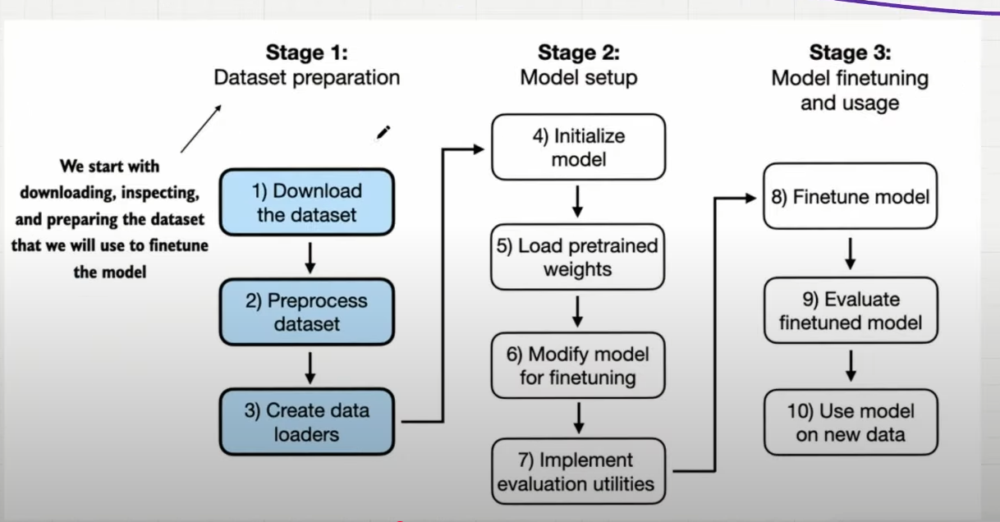
> Fig: Classification Finetunning Workflow


> **Implementation Highlights:**


### 1. Dataset Preparation

* Balanced spam/ham classes with **label encoding** and proper train/validation/test splits.
* Created custom **SpamDataset** class for tokenization, truncation, padding, and batching.
* Ensured **consistent token counts per batch** to stabilize gradients and optimize GPU computation.

### 2. Tokenization & DataLoader Engineering

* Applied GPT-2 tokenizer with **padding and truncation** for uniform sequence length.
* Constructed **PyTorch DataLoaders** for efficient mini-batching.
* Custom batching ensured identical token counts per batch, preventing unstable updates.

### 3. Model Architecture

* Loaded **pretrained GPT-2 weights** from Part 1.
* Replaced GPT-2’s 50,257-dim vocabulary projection with a **2-class linear classification head**.
* **Selective fine-tuning:** froze all layers except the last transformer block and final LayerNorm, preserving pretrained knowledge while adapting to spam detection.
  
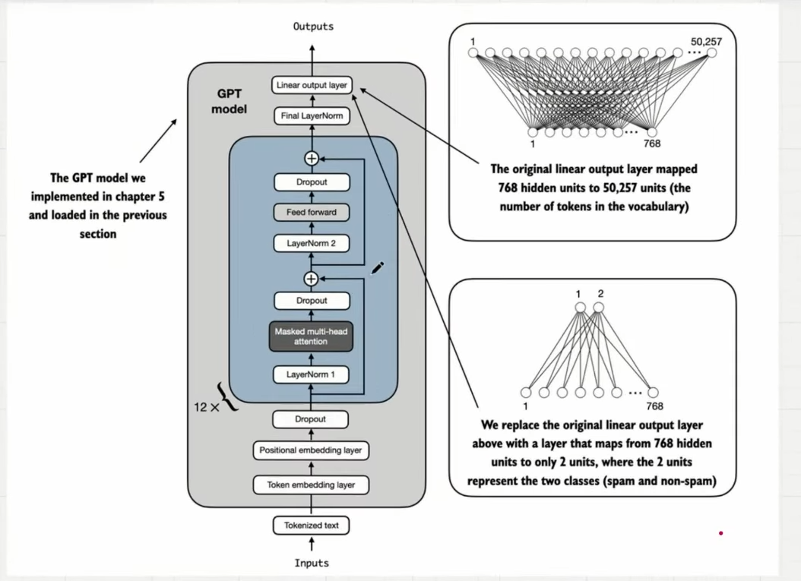
> Fig: Model Architecture for Classification Finetunning

### 4. Training Configuration

* Optimizer: **AdamW** with `lr=5e-5`, `weight_decay=0.1`.
* Loss: **Cross-Entropy**.
* Epochs: 5 with periodic evaluation.
* Monitored **train/validation accuracy and loss** for convergence and generalization.
* Training was stable with rapid convergence, minimal overfitting observed.


### 5. Evaluation & Performance

* Loss dropped sharply, minimal train-val gap → effective transfer learning.
* Built `classify_review` function for inference: input text → tokenization → padding → logits → predicted label.
  
>  **Performance Before vs After Training:**

| Metric               | Before Training | After Training |
|---------------------|----------------|---------------|
| Training Accuracy    | 46.25%         | 99.43%        |
| Validation Accuracy  | 53.75%         | 97.32%        |
| Test Accuracy        | 50.00%         | 96.67%        |

> **Note:** Slight differences between validation and test accuracy indicate **minimal overfitting**, thanks to selective layer unfreezing, proper padding, and batch handling.

---

### **Results & Insights**

* Selective unfreezing leverages pretrained features: shallow layers capture grammar/syntax; deep layers learn task-specific semantics.
* Proper padding and batch engineering stabilize gradient flow and optimize GPU usage.
* Achieved **production-ready performance** with a moderate-sized (124M) GPT-2 model.
  
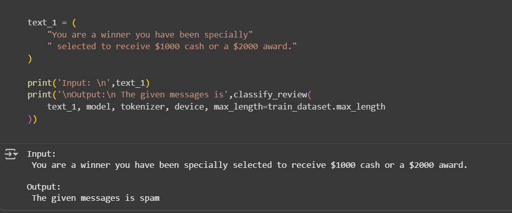
> Fig: Sample Output of Finetuned model
  
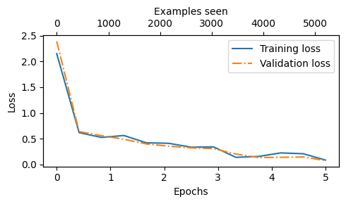
> FIG: Train-Validation Loss Vs Epochs Vs No to Token Seen

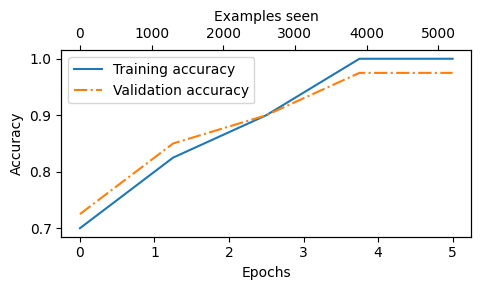
> FIG: Train-Validation accuracy Vs Epochs Vs No to Token Seen

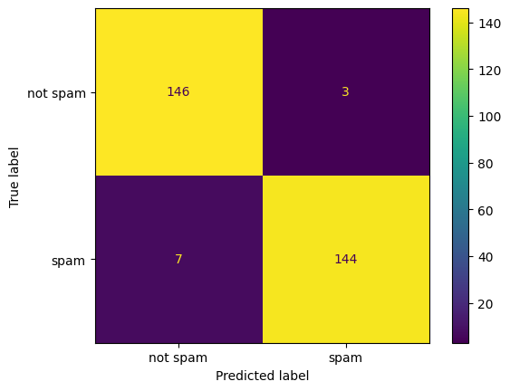
> FIG: Confusion Matrix


### **Key Takeaways**

* Fine-tuning pretrained LLMs enables **rapid adaptation to downstream tasks** with minimal compute.
* Careful layer selection, padding, and batch handling prevent overfitting and maintain high performance.
* Demonstrates practical, **real-world AI capability**: spam detection, toxic comment filtering, intent recognition, grievance routing, etc.


---

## **Part 3: Instruction Fine-Tuning GPT-2 (355M)**

**Objective:**  
The goal was to transform GPT-2 (355M) into an **instruction-following assistant** using ~1.1k Alpaca-style instruction→response pairs, adapting the model from generic text generation to **task-aligned outputs**.

> **Workflow of Instruction Fine-Tuning**

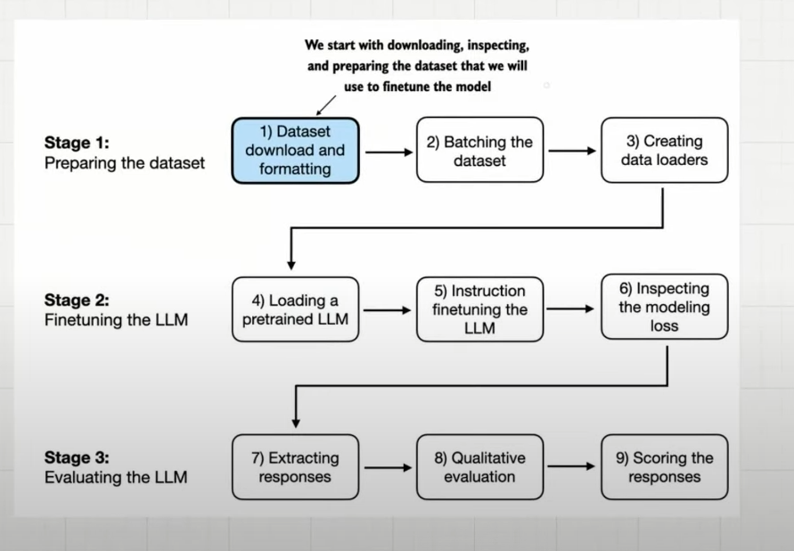

---

### 1. Dataset & Format

* Alpaca-style JSON dataset: `{instruction, input, output}` (response is the same as `output` in this setup).  
* Proper **train/validation/test splits** applied.  
* Dynamic **collation & masking** per batch:  
  * Causal LM setup: each token predicts the next token (`inputs[:-1] → targets[1:]`)  
  * Pad tokens masked with `-100` for loss computation  
  * Optional **instruction masking** left for future experimentation to avoid overfitting on repeated instructions.

---

### 2. Model & Training

* Full **GPT-2 (355M) weights updated** (no PEFT).  
* Optimizer: **AdamW**, `lr=5e-5`, `weight_decay=0.1`.  
* Training objective: **next-token prediction** guided by structured instructions.  
* Training and validation loss progression:  

  | Stage                 | Train Loss | Val Loss | Notes |
  |-----------------------|------------|----------|-------|
  | Before fine-tuning    | 4.197      | 4.113    | Pretrained GPT-2 baseline |
  | Step ~100             | ~0.51      | ~0.69    | Rapid initial collapse (small dataset) |
  | After 5 epochs        | ~0.17      | ~0.70    | Run time per epoch ≈ 7.77 min |

* Outputs saved in JSON for **downstream automated and human evaluation**.

> Note: The rapid train loss collapse is expected due to the small dataset (~1.1k examples). Validation loss stabilizes around 0.7, suggesting reasonable generalization.


### 3. Evaluation Strategy

Classical metrics (F1, R²) are insufficient for **free-text instruction outputs**.  

**Techniques used:**  
* **MMLU:** Multi-domain multiple-choice benchmark for knowledge and reasoning assessment.  
* **Human evaluation:** Domain experts rate **correctness, helpfulness, and safety** (gold standard).  
* **Automated conversational benchmarking:** GPT-2 outputs scored using **meta-llama/Meta-Llama-3-8B-Instruct** for fast, reproducible insights (note: can be biased).  

> Result: GPT-2 (355M) scored **53.79/100**, providing quantitative insight into instruction-following performance.


### 4. Practical Considerations

* Single-run risks: random seed, shuffling, and hardware nondeterminism affect stability.  
* Recommended: **multi-seed, multi-checkpoint evaluation**.  
* Future directions:  
  * **PEFT (LoRA, QLoRA, adapters):** compute-efficient fine-tuning to reduce GPU cost.  
  * Diversified instructions, adversarial prompts, and curriculum learning.  
  * Combine meta-LLM automated scoring with human references for **robust evaluation**.


### 5. Results & Insights

* Instruction fine-tuning produced **measurable improvements**:  
  * Loss collapse during training  
  * Sensible, aligned outputs  
* Provides a **baseline production-ready instruction-tuned LLM** for downstream applications like **chatbots, automated grievance routing, and domain assistants**.

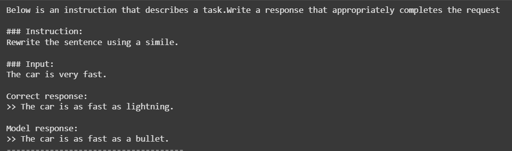  
> FIG: Sample Output of Instruction Fine-Tuned LLM

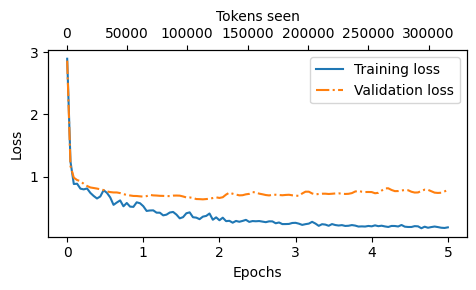  
> FIG: Train-Validation Loss vs Epochs vs Number of Tokens Seen


### 6. Key Takeaways

* Instruction fine-tuning transforms a pretrained GPT-2 model into a **task-aligned assistant**.  
* Full fine-tuning is feasible **without massive models**.  
* Future experiments with **multi-seed PEFT runs** and richer datasets will further improve performance and efficiency.

---


## **Installation**

```bash
# Clone repository
git clone https://github.com/yourusername/gpt2-from-scratch.git
cd gpt2-from-scratch

# Create environment
conda create -n gpt2 python=3.10
conda activate gpt2

# Install dependencies
pip install -r requirements.txt
```

---

## **Usage**

Launch the Jupyter notebook to explore the **step-by-step implementation, training, and fine-tuning** of GPT-2:

```bash
jupyter notebook notebooks/llm-from-scratch.ipynb
```

> The notebook covers:
>
> * **Training GPT-2 from scratch** on raw text
> * **Fine-tuning GPT-2 for classification** tasks
> * **Instruction fine-tuning GPT-2 (355M)** for task-aligned outputs

All pipelines are modular, reproducible, and include visualizations of **loss curves, sample generations, attention maps, and evaluation metrics**.

---


## **Contributing**

* Implemented in **PyTorch**, modular and extendable
* Supports **custom datasets, model scaling, and fine-tuning pipelines**
* Open to improvements on **PEFT, instruction datasets, and evaluation strategies**


---


## Repository Structure

```
.gitignore                 # Git ignore rules
LICENSE                    # MIT License
pyproject.toml             # Project configuration and dependencies
README.md                  # This documentation
requirements.txt           # Python dependencies

data/                      # Datasets used for experiments
    the-verdict.txt        # Raw text dataset for GPT-2 training
    classification/        # Classification datasets
        instruction-data-with-response.json
        ...
    instruction-finetuning/ # Instruction fine-tuning datasets
        instruction-data.json
        ...

figs/                      # Generated figures and visualizations
    classification/        # Classification loss, accuracy, confusion matrices
    instruction-finetuning/ # Training curves, sample outputs, evaluation metrics

models/                    # Trained model checkpoints
    instruction-finetuned_model.pth
    instruction-finetuned-gpt-medium-model.pth
    review_classifier.pth

models_dict/               # Pretrained model weight dictionaries
    gpt2/

notebooks/                 # Step-by-step Jupyter notebooks
    llm-from-scratch.ipynb

notes-ss/                  # Lecture/implementation screenshots
    lec_28_gpt_forward_pass.png
    ...

official-notebooks/        # Reference notebooks for evaluation and benchmarking
    Fine_tuned_LLM_Evaluation.ipynb
    ...

scripts/                   # Modular Python scripts for training, fine-tuning, evaluation
    __init__.py
    ...
```
--- 

## Getting Started

### Prerequisites

* Python 3.9+
* [PyTorch](https://pytorch.org/)
* Jupyter Notebook
* Standard libraries: `numpy`, `tqdm`

### Installation

Clone the repository and install dependencies:

```bash
git clone https://github.com/kushalregmi61/building-llm-from-scratch.git
cd building-llm-from-scratch
pip install -r requirements.txt
```

--- 
### Usage

Launch the notebook to explore step-by-step implementations:

```bash
jupyter notebook notebooks/llm-from-scratch.ipynb
```

--- 

## Contributing

Contributions are welcome! If you’d like to add new components, improve implementations, or extend documentation, please open an issue or submit a pull request.

--- 

## License

This project is licensed under the [MIT License](LICENSE).


